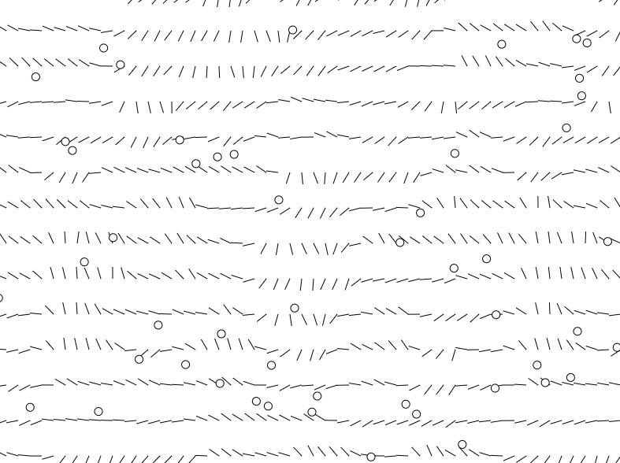

# Phind - AI search engine



🤓 **Prompting an AI**

🤖 *AI answers*

💬 Commenting on what happened

---
## Interaction 1

🤓 : **I would like to create an interactive animation using p5js. I would like to have a flock of agents moving according to a flow field : can you help me ?**


🤖 : *To create an interactive animation using p5.js with a flock of agents moving according to a flow field, you can follow these steps:*

*First, make sure you have the p5.js library downloaded and included in your project. You can download it from the p5.js website [2].*

*Create an HTML file, index.html, and include the p5.js library by adding the following script tag to the head of your HTML file:*

```
<script src="path/to/p5.min.js"></script>
```

*Replace "path/to/p5.min.js" with the actual path to the p5.js library file.*

*Create a JavaScript file, sketch.js, where you will write your p5.js code.*

*In sketch.js, define the necessary variables and functions for the flock of agents and the flow field.*

*To create the flock of agents, you can use the Boid class. Each Boid object represents an agent in the flock. The Boid class should have properties like position, velocity, acceleration, and methods like update, applyForce, and display. Here's an example implementation of the Boid class:*

```js
class Boid {
  constructor() {
    this.position = createVector(random(width), random(height));
    this.velocity = createVector(random(-1, 1), random(-1, 1));
    this.acceleration = createVector();
  }

  update() {
    // Update velocity and position based on acceleration
    this.velocity.add(this.acceleration);
    this.position.add(this.velocity);
    // Reset acceleration
    this.acceleration.mult(0);
  }

  applyForce(force) {
    // Apply force to acceleration
    this.acceleration.add(force);
  }

  display() {
    // Display the boid as a shape or image
    // Example: ellipse(this.position.x, this.position.y, 10, 10);
  }
}
```

*To create the flow field, you can use Perlin noise to generate a grid of vectors that represent the direction of movement for each point in the grid. You can then use these vectors to influence the behavior of the agents in the flock. Here's an example implementation of the flow field generation:*

```js
// Create a 2D flow field grid
let flowField = [];

function generateFlowField() {
  for (let x = 0; x < width; x += gridSize) {
    for (let y = 0; y < height; y += gridSize) {
      // Calculate the angle based on Perlin noise
      let angle = noise(x * noiseScale, y * noiseScale) * TWO_PI;
      // Create a vector with magnitude 1 and angle based on Perlin noise
      let vector = p5.Vector.fromAngle(angle);
      // Store the vector in the flow field grid
      flowField.push(vector);
    }
  }
}
In the setup function of sketch.js, initialize the canvas, create the flock of agents, and generate the flow field:
function setup() {
  createCanvas(800, 600);
  // Create the flock of agents
  flock = [];
  for (let i = 0; i < numBoids; i++) {
    flock.push(new Boid());
  }
  // Generate the flow field
  generateFlowField();
}
```

*In the draw function of sketch.js, update and display the flock of agents, and apply the flow field forces to the agents:*

```js
function draw() {
  background(255);
  // Update and display the flock of agents
  for (let boid of flock) {
    // Apply the flow field force to the agent
    let x = floor(boid.position.x / gridSize);
    let y = floor(boid.position.y / gridSize);
    let index = x + y * (width / gridSize);
    let force = flowField[index];
    boid.applyForce(force);
    // Update and display the agent
    boid.update();
    boid.display();
  }
}
```

*You can customize the behavior of the flock and the flow field by adjusting the parameters like the number of agents, the size of the flow field grid, the noise scale, and more.*

*Run your HTML file in a web browser, and you should see the flock of agents moving according to the flow field.*

*These steps provide a basic framework for creating an interactive animation with a flock of agents moving according to a flow field using p5.js. You can further enhance the animation by adding interactivity, different behaviors for the agents, and visual effects.*


## Interaction 2

🤓 :	**Assembling the code I got this error :
sketch.js:24 Uncaught (in promise) ReferenceError: numBoids is not defined
    at setup (sketch.js:24:23)
    at v._setup (p5.min.js:2:461622)
    at v._start (p5.min.js:2:460389)
    at new v (p5.min.js:2:464548)
    at p5.min.js:2:451299
can you help me fix it ?**

🤖: *The error message "Uncaught (in promise) ReferenceError: numBoids is not defined" indicates that the variable numBoids is not defined in your code. To fix this error, you need to define the numBoids variable with a value before using it in the setup function.*

*Here's an example of how you can define the numBoids variable in sketch.js:*

```js
// Define the number of boids
const numBoids = 10;

// Rest of your code...
```

*Make sure to adjust the value of numBoids to the desired number of agents in your flock.*

*By defining the numBoids variable before using it in the setup function, you should resolve the "numBoids is not defined" error.*

*If you still encounter any issues or errors, please provide more details about your code or share the relevant parts of your sketch.js file so that I can assist you further.*


## Interactions 3 to 7

💦💦💦
a few moments later ...
(with the same kind of errors)
💦💦💦


## Interaction 8

**the boids just go out of the screen is it possible to make them warp around ?**

🤖 : *To make the boids warp around the screen instead of going off-screen, you can implement a wrapping behavior in your code. Here's how you can modify your code to achieve this:*

*In the update function of your boid class, check if the boid's position exceeds the screen boundaries.
If the boid goes off the screen, wrap its position around to the opposite side.*

*Here's an example implementation based on the code you provided:*

```js
// Wrap the boid around the screen
Boid.prototype.wrapScreen = function() {
  if (this.x < 0) {
    this.x = width;
  } else if (this.x > width) {
    this.x = 0;
  }
  if (this.y < 0) {
    this.y = height;
  } else if (this.y > height) {
    this.y = 0;
  }
}

// Update the boid's position
Boid.prototype.update = function() {
  // Update the position based on velocity
  this.x += this.xVelocity;
  this.y += this.yVelocity;

  // Wrap the boid around the screen
  this.wrapScreen();
}
```

*By adding the wrapScreen function to your boid class and calling it in the update function, the boids will wrap around the screen when they reach the edges.*

*Note that the width and height variables in the code above refer to the dimensions of your canvas. Make sure to adjust them accordingly.*

*By implementing this wrapping behavior, the boids will stay within the visible area of the screen and create a continuous flow.*


💬💬💬

We have a small issue here because phind doesn't take into account the code it actually wrote for us. In the boid class it provided us the 'x' and 'y' fields don't actually exist ... it used a vector named 'position' instead. (and the way to overload the class is not consistent with the way the class wa written earlier)

Providing the code after the question does fix this

💬💬💬

## Interaction 9 : giving more context

🤓 : **The boids don't wrap around the screen although I followed all your instructions, how is possible considering the code joined ?**

🤖 : *I apologize for the confusion. It seems that the issue with the boids not wrapping around the screen is due to a mistake in the wrapScreen function. In the function, you are referencing this.x and this.y, but those properties are not defined in the Boid class.*

*To fix the issue, you need to update the wrapScreen function to reference this.position.x and this.position.y instead. Here's the corrected code:*

```js
// Wrap the boid around the screen
wrapScreen() {
  if (this.position.x < 0) {
    this.position.x = width;
  } else if (this.position.x > width) {
    this.position.x = 0;
  }
  if (this.position.y < 0) {
    this.position.y = height;
  } else if (this.position.y > height) {
    this.position.y = 0;
  }
}
```

*By updating the code to use this.position.x and this.position.y, the boids should now wrap around the screen correctly.*

## Interaction 10

🤓 : **How can I modify my existing code to actually display the vectors of the flow field ?**

🤖 : *To modify your existing code to display the vectors of the flow field, you can make the following changes:*

*Add a new function called displayFlowField() inside the Boid class. This function will iterate over the flowField array and draw a line to represent each vector in the flow field. Here's an example implementation:*

```js
displayFlowField() {
  for (let x = 0; x < width; x += gridSize) {
    for (let y = 0; y < height; y += gridSize) {
      let index = x + y * (width / gridSize);
      let vector = flowField[index];
      let start = createVector(x, y);
      let end = p5.Vector.add(start, vector.mult(gridSize));
      line(start.x, start.y, end.x, end.y);
    }
  }
}
```

*Call the displayFlowField() function inside the draw() function, before updating and displaying the boids. This will ensure that the flow field vectors are drawn on the canvas. Here's how the updated draw() function should look:*

```js
function draw() {
  background(255);
  // Display the flow field
  displayFlowField();
  
  // Update and display the flock of agents
  for (let boid of flock) {
    // Apply the flow field force to the agent
    let x = floor(boid.position.x / gridSize);
    let y = floor(boid.position.y / gridSize);
    let index = x + y * (width / gridSize);
    let force = flowField[index];
    boid.applyForce(force);
    
    // Update and display the agent
    boid.update();
    boid.display();
  }
}
```

*By adding the displayFlowField() function and calling it in the draw() function, you should be able to see the vectors of the flow field displayed on the canvas.*

*Please give it a try and let me know if you have any further questions.*

## Interaction 11

🤓: **Uncaught TypeError: Cannot read properties of undefined (reading 'mult')
    at displayFlowField (sketch.js:31:45)
    at draw (sketch.js:53:3)
    at e.default.redraw (p5.min.js:2:542441)
    at _draw (p5.min.js:2:462354)**

🤖 : *Apologies for the confusion. It seems that there was an error in the code I provided. The error message suggests that the mult() function is being called on an undefined object.*

*To fix this issue, you need to ensure that the vector variable in the displayFlowField() function is not undefined. Here's an updated version of the function that includes a check for undefined vectors:*

```js
displayFlowField() {
  for (let x = 0; x < width; x += gridSize) {
    for (let y = 0; y < height; y += gridSize) {
      let index = x + y * (width / gridSize);
      let vector = flowField[index];
      if (vector) {
        let start = createVector(x, y);
        let end = p5.Vector.add(start, vector.mult(gridSize));
        line(start.x, start.y, end.x, end.y);
      }
    }
  }
}
```

*In this updated version, the if (vector) statement checks if the vector variable is defined before proceeding with the drawing. This will prevent the mult() function from being called on an undefined vector.*

*Please give it a try and let me know if you encounter any further issues.*

💬💬💬

Well there is a real issue here ! And I didn't manage to make phind find the solution even with many iteration. By experience, the visual result hinted me towards an issue with the vector method and the copy / shallow copy of vectors.

If you look more closely at the documentation : https://p5js.org/reference/#/p5.Vector/mult

You will see this : "The static version of this method creates a new p5.Vector while the non-static version acts on the vector directly."

So the line provided by phind 
```js
let end = p5.Vector.add(start, vector.mult(gridSize));
```
actually builds up the 'vector' it should be adressed statically.

```js
let end = p5.Vector.add(start,  p5.Vector.mult(gridSize));
```


