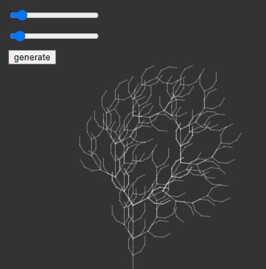

# Phind - AI search engine



🤓 **Prompting an AI**

🤖 *AI answers*

💬 Commenting on what happened

---
## Interaction 1

🤓 : **Can you help me implement a L-system in p5js ?**


🤖 : *What specific L-system do you want to implement? For example, are you interested in creating a fractal tree, a dragon curve, or something else*


🤓 :	**Can you tell me other kind of l-systems and give me a few sources where I can see what each one looks like ?**

🤖: *Sure, L-systems (Lindenmayer systems) are a parallel rewriting system and a type of formal grammar. They are used to model and visualize the growth of plants and development of fractals. Here are a few types of L-systems and their visual representations:*

*Algae: This is the original L-system introduced by Lindenmayer. It's a simple system that models the growth of certain types of algae.*
*Cantor set: This L-system produces the famous Cantor's fractal set on a real straight line R.*
*Sierpinski triangle: This L-system approximates the Sierpinski triangle. In this system, F and G mean "draw forward", + means "turn left by angle", and − means "turn right by angle".*
*Space-filling curves: These include the Hilbert curve, Peano's curves, Dekking's church, and kolams.*
*Median space-filling curves: These include the Lévy C curve, Harter-Heighway dragon curve, and Davis-Knuth terdragon.*
*The visual representation of these L-systems can be found on the Wikipedia page for L-systems en.wikipedia.org.*

Now, let's discuss how you can implement an L-system in p5.js. P5.js is a JavaScript library used for creating graphics and interactive experiences in the browser.*

*Here is a basic implementation of an L-system in p5.js:*

```js
let axiom = "F";
let sentence = axiom;
let len = 100;

let rules = [];
rules[0] = {
  a: "F",
  b: "FF+[+F-F-F]-[-F+F+F]"
}

function generate() {
  len *= 0.5;
  let nextSentence = "";
  for (let i = 0; i < sentence.length; i++) {
    let current = sentence.charAt(i);
    let found = false;
    for (let j = 0; j < rules.length; j++) {
      if (current == rules[j].a) {
        found = true;
        nextSentence += rules[j].b;
        break;
      }
    }
    if (!found) {
      nextSentence += current;
    }
  }
  sentence = nextSentence;
  createP(sentence);
  turtle();
}

function turtle() {
  background(51);
  resetMatrix();
  translate(width / 2, height);
  stroke(255, 100);
  for (let i = 0; i < sentence.length; i++) {
    let current = sentence.charAt(i);

    if (current == "F") {
      line(0, 0, 0, -len);
      translate(0, -len);
    } else if (current == "+") {
      rotate(PI / 6);
    } else if (current == "-") {
      rotate(-PI / 6);
    } else if (current == "[") {
      push();
    } else if (current == "]") {
      pop();
    }
  }
}

function setup() {
  createCanvas(400, 400);
  background(51);
  createP(axiom);
  turtle();
  let button = createButton("generate");
  button.mousePressed(generate);
}


```
*In this code:*

*We start with an initial sentence (the axiom) "F".*
*We have a single rule: whenever we see an "F", replace it with "FF+[+F-F-F]-[-F+F+F]".*
*A "+" means "rotate a certain angle", a "-" means "rotate a certain angle in the other direction", and "[" and "]" are used to save and restore the current state, respectively.*
*We use the generate function to create the next sentence.*
*We use the turtle function to draw the sentence.*
*You can modify the rules and the axiom to create different types of L-systems [https://jsantell.com/l-systems/](https://jsantell.com/l-systems/).*


